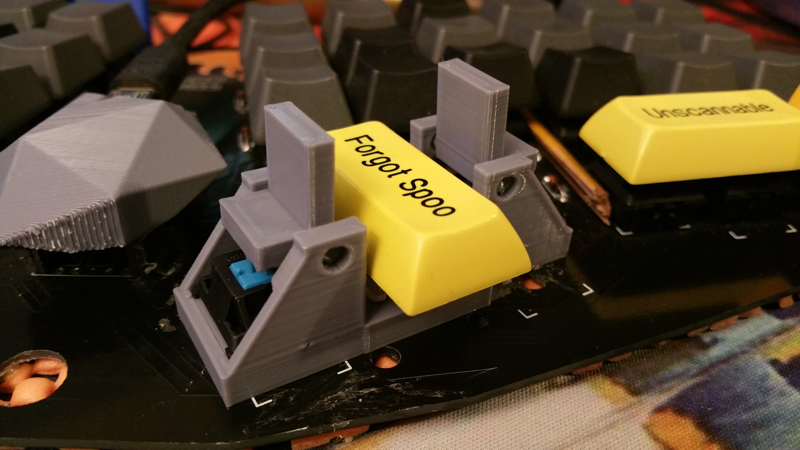
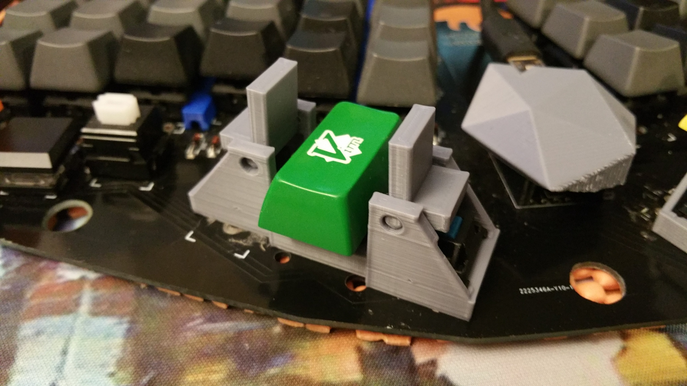
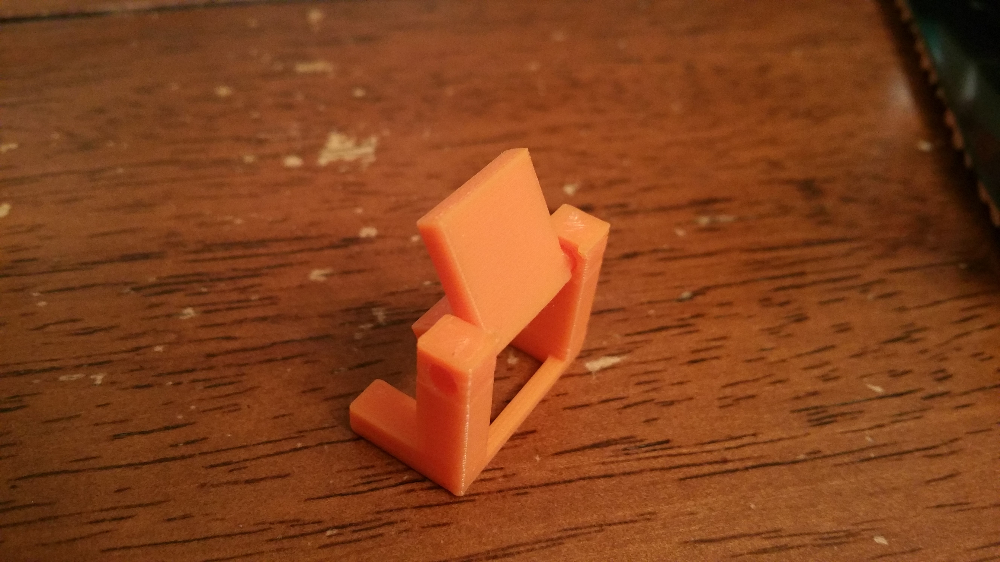
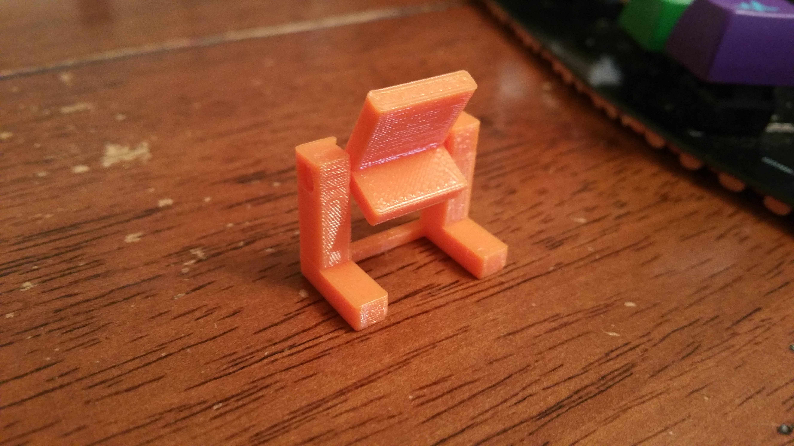
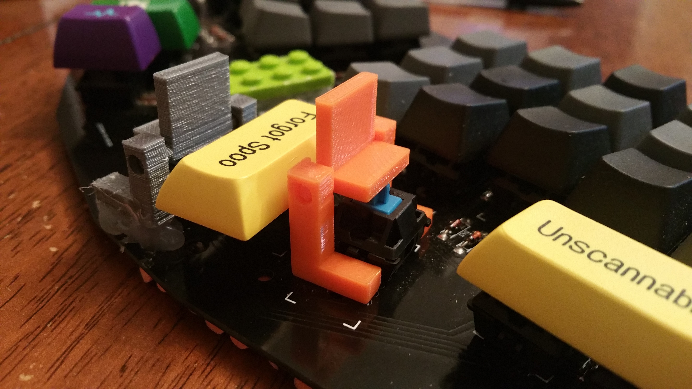

# mx_paddles_3d_print

Signum keyboards can have paddle triads available in ```signum_paddle_triads.scad```




Paddle triads are ONLY COMPATIBLE WITH ```paddle2.1.stl```!


# Original paddles are below:

Cherry mx (or clone) compatible paddle for side actuation







[Youtube video actuation motion (earlier version)](https://www.youtube.com/watch?v=5LNU0hlYoxQ)
